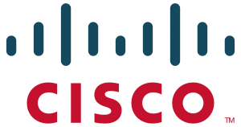

# Internet service provider (ISP)

## Table of Contents

- [About](#about)
- [Installation](#Installation)
- [Run](#run)
- [Questions?](#questions)
- [License](#license)

## About

An Internet service provider (ISP) is an organization that provides services 
for accessing, using, or participating in the Internet. Internet service 
providers can be organized in various forms, such as commercial, 
community-owned, non-profit, or otherwise privately owned. 
Internet services typically provided by ISPs include Internet access, Internet 
transit, domain name registration, web hosting, Usenet service, and 
colocation.

## Installation

Softwares we use in this project is simply Oracle VM virtualbox to run a 
Debian image on virtual machine. 
You can install it [HERE](https://www.virtualbox.org/wiki/Downloads).
 

## Run

Open the Debian image on the virtual machine, then log in:

	login    : n7
	password : n7

Then open a terminal, and type : 

	cd Bureau//YANE_GUI/Projets/MOUDDENE
	sudo ./START

Here servals dockers will appear representing the whole architecture of my ISP 
network(Client, DHCP server, routers and servers, etc...). 
To stop the dockers, you have to type : 

	sudo ./STOP

## License

The library is Software released under Apache-2.0 [License](LICENSE.txt).
