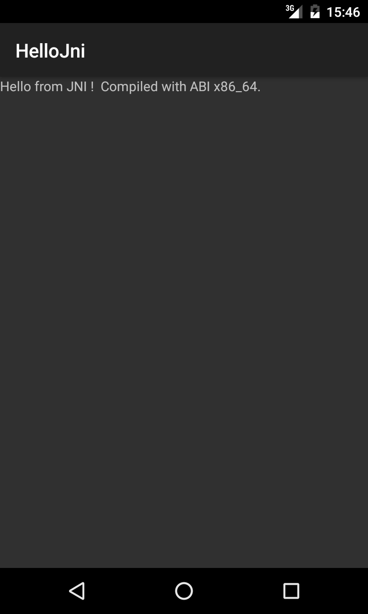

# Hello JNI!

The classical Hello World application in JNI sauce printing out the message using a native method.

## Settings

In order to build the application you need the NDK (Native Development Kit) installed (see [Android NDK](http://developer.android.com/tools/sdk/ndk/index.html)). 

Once you have installed it, you need to configure the project by telling Android Studio the path to the NDK. According to the version of Android Studio you are using you can do it in one of these two ways:

* `File > Project Structure...` and under `SDK Location` give the path to the NDK in the related field;

* or manually editing the `local.properties` file in the root of this project by adding a line `sdk.dir=path/to/android/sdk` at the end.

## Screenshots

